[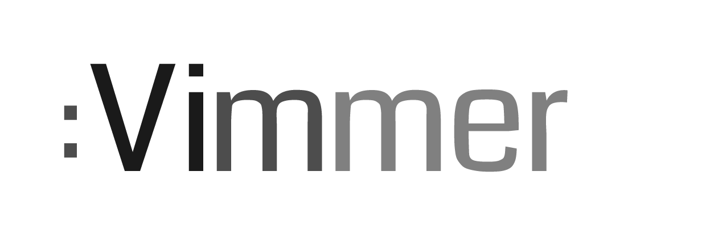][vimmer]

## Introduction

Vimmer's artwork is here for the community to use.  We simply ask that you 
**do not**:

- Use any of the artwork for commercial purposes.
- Publish altered versions of the artwork without asking for permission.

That is the summary of our desires.  If you want to read the long version of
this, the license we chose is the [Creative Commons BY-NC-ND 4.0][boring]
license.

[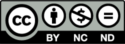][license]

## Links

|      | Light                                                                                       | Dark                                                                                   |
|------|---------------------------------------------------------------------------------------------|----------------------------------------------------------------------------------------|
| Logo | [![Light][prev-logo-light]][logo-light-svg]<br>[SVG][logo-light-svg], [PNG][logo-light-png] | [![Dark][prev-logo-dark]][logo-dark-svg]<br>[SVG][logo-dark-svg], [PNG][logo-dark-png] |
| Icon | [![Light][prev-icon-light]][icon-light-svg]<br>[SVG][icon-light-svg], [PNG][icon-light-png] | [![Dark][prev-icon-dark]][icon-dark-svg]<br>[SVG][icon-dark-svg], [PNG][icon-dark-png] |

## File Info

The artwork was created using Adobe Illustrator CC.  A script exports the SVG
files from Illustrator.  The exported SVG files are used as the base graphics
for colorization and rendering raster images.

We can't accept pull requests for graphic sources since it would be difficult
to review them at a glance.  If you have fixes or changes you would like to
propose, please create an issue instead.  Pull requests for the automation
scripts are welcome, however.

## Exporting

If you wish to color or render a raster image, you will get the most consistent
results using the `scripts/build.py` script.  Arguments can be seen with
`scripts/build.py --help`.  More detail can be found under [Palette](#Palette).

If you want to export directly from Illustrator, these are the settings that
are used by the export script:

#### SVG

| Property   | Value                   |
|------------|-------------------------|
| Styling    | Presentation Attributes |
| Font       | Convert To Outlines     |
| Images     | Preserve                |
| Object IDs | Layer Names             |
| Decimal    | 3                       |
| Minify     | True                    |
| Responsive | True                    |

#### PNG

| Property         | Value                         |
|------------------|-------------------------------|
| Resolution       | Screen (72 ppi)               |
| Anti-aliasing    | Art Optimized (Supersampling) |
| Interlaced       | False                         |
| Background Color | Transparent                   |


## Presentation

The logo faintly highlights three words that are topics of interest on
`vimmer.net`:

- `Vi` - The ancestor
- `Vim` - The Vim text editor
- `Vimmer` - You 😻

It's styled to look like a Vim command that has an optional short form.

#### Font

- [Coda Regular](https://fonts.google.com/specimen/Coda)

#### Palette

The logo's palette is currently undefined.  A grayscale palette is used
for tinting/shading.  As of this writing, the brand consists of a single color
whose white and black levels are averaged with grayscale colors used in the
source graphic.  When used on dark backgrounds, the white and black levels are
inverted to maintain a color prominence traveling from left to right.

##### Used grayscale colors

|                         | R   | G   | B   | Hex     |
|-------------------------|-----|-----|-----|---------|
|  | 51  | 51  | 51  | #333333 |
|  | 102 | 102 | 102 | #666666 |
|  | 153 | 153 | 153 | #999999 |

#### Colorizing

Coloring the artwork is done through the `scripts/build.py` script.  The
following images were colored with:

Installation:

```
$ virtualenv .
$ . bin/activate
$ pip3 install -r scripts/requirements.txt
```

Usage:

```
$ scripts/build.py color --in ${input}.svg --out ${output}.png --base-color $color --bg $bg
```

- `$input` is one of the SVG files in the `source/` directory.
- `$output` is the output file.
- `$color` is a hexadecimal color (shown below).
- `$bg` is a value between `0` and `255` to produce a gray RGB triplet. For the
  examples below:
  - `255` for light backgrounds.
  - `0` for dark backgrounds.

If `--bg` is omitted, the background will be transparent and the colors will be
treated as if the background is light.

##### Taste the rainbow

| `$color`  |                                          |                                         |                                          |                                         |
|-----------|------------------------------------------|-----------------------------------------|------------------------------------------|-----------------------------------------|
| `#ff0000` | 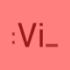    | 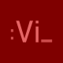    | 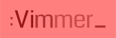    |     |
| `#ff7f00` | 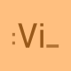 | 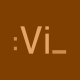 |  | 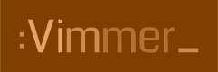 |
| `#ffff00` | 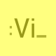 | 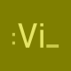 | 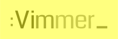 | 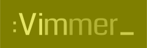 |
| `#00ff00` | 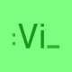  |   | 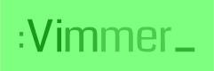  |   |
| `#0000ff` |    |    |    |    |
| `#4b0082` |  | 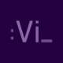 |  |  |
| `#8b00ff` | 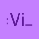 |  |  |  |

## Author

<table>
  <tbody>
    <tr>
      <td>
        <a href="https://github.com/tweekmonster"></a>
      </td>
      <td>
        <a href="https://github.com/tweekmonster">Tommy Allen</a>
      </td>
    </tr>
  </tbody>
</table>

[license]: http://creativecommons.org/licenses/by-nc-nd/4.0/
[boring]: https://creativecommons.org/licenses/by-nc-nd/4.0/legalcode
[vimmer]: http://vimmer.net
[author]: https://github.com/tweekmonster
[prev-logo-light]: .meta/preview/logo_light_light.png
[prev-logo-dark]:  .meta/preview/logo_dark_dark.png
[prev-icon-light]: .meta/preview/icon_light_light.png
[prev-icon-dark]:  .meta/preview/icon_dark_dark.png
[logo-light-svg]:  build/svg/logo_light.svg?raw=true
[logo-dark-svg]:   build/svg/logo_dark.svg?raw=true
[icon-light-svg]:  build/svg/icon_light.svg?raw=true
[icon-dark-svg]:   build/svg/icon_dark.svg?raw=true
[logo-light-png]:  build/png/logo_light.png?raw=true
[logo-dark-png]:   build/png/logo_dark.png?raw=true
[icon-light-png]:  build/png/icon_light.png?raw=true
[icon-dark-png]:   build/png/icon_dark.png?raw=true
