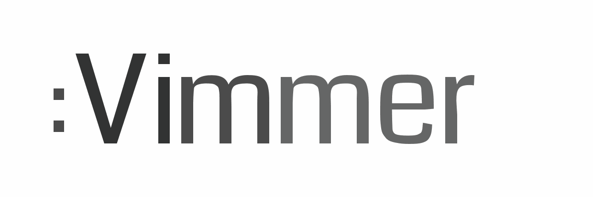

[][vimmer]

## Introduction

Vimmer's artwork is here for the community to use.  We simply ask that you 
**do not**:

- Use any of the artwork for commercial purposes.
- Publish altered versions of the artwork without asking for permission.

That is the summary of our desires.  If you want to read the long version of
this, the license we chose is the [Creative Commons BY-NC-ND 4.0][boring]
license.

[][license]

## Links

|      | Light                                                                                       | Dark                                                                                   |
|------|---------------------------------------------------------------------------------------------|----------------------------------------------------------------------------------------|
| Logo | [![Light][prev-logo-light]][logo-light-svg] [SVG][logo-light-svg], [PNG][logo-light-png] | [![Dark][prev-logo-dark]][logo-dark-svg] [SVG][logo-dark-svg], [PNG][logo-dark-png] |
| Icon | [![Light][prev-icon-light]][icon-light-svg] [SVG][icon-light-svg], [PNG][icon-light-png] | [![Dark][prev-icon-dark]][icon-dark-svg] [SVG][icon-dark-svg], [PNG][icon-dark-png] |

## File Info

The artwork was created using Adobe Illustrator CC.  Since the files in this
repository are binary, we can't accept pull requests.  If you have fixes or
changes you would like to propose, please create an issue instead.

### Export Settings

#### SVG

| Property   | Value                   |
|------------|-------------------------|
| Styling    | Presentation Attributes |
| Font       | Convert To Outlines     |
| Images     | Preserve                |
| Object IDs | Layer Names             |
| Decimal    | 3                       |
| Minify     | True                    |
| Responsive | True                    |

#### PNG

| Property         | Value                         |
|------------------|-------------------------------|
| Resolution       | Screen (72 ppi)               |
| Anti-aliasing    | Art Optimized (Supersampling) |
| Interlaced       | False                         |
| Background Color | Transparent                   |

## Font

- [Coda Regular](https://fonts.google.com/specimen/Coda)

## Palette

The logo uses shades of web safe gray which allows it to be tinted easily.

#### Light Background

|                               | R   | G   | B   | Hex     |
|-------------------------------|-----|-----|-----|---------|
|  | 26  | 26  | 26  | #1a1a1a |
|  | 77  | 77  | 77  | #4d4d4d |
|  | 128 | 128 | 128 | #808080 |

#### Dark Background

|                              | R   | G   | B   | Hex     |
|------------------------------|-----|-----|-----|---------|
|  | 102 | 102 | 102 | #666666 |
|  | 153 | 153 | 153 | #999999 |
|  | 204 | 204 | 204 | #cccccc |
|  | 51  | 51  | 51  | #333333 |

## Author

<table>
  <tbody>
    <tr>
      <td>
        
      </td>
      <td>
        <a href="https://github.com/tweekmonster">Tommy Allen</a>
      </td>
    </tr>
  </tbody>
</table>

[license]: http://creativecommons.org/licenses/by-nc-nd/4.0/
[boring]: https://creativecommons.org/licenses/by-nc-nd/4.0/legalcode
[vimmer]: http://vimmer.net
[author]: https://github.com/tweekmonster
[prev-logo-light]: .meta/preview/Vimmer_Logo_Light.png
[prev-logo-dark]: .meta/preview/Vimmer_Logo_Dark.png
[prev-icon-light]: .meta/preview/Vimmer_Icon_Light.png
[prev-icon-dark]: .meta/preview/Vimmer_Icon_Dark.png
[logo-light-svg]: svg/Vimmer_Logo_Light.svg?raw=true
[logo-dark-svg]: svg/Vimmer_Logo_Dark.svg?raw=true
[icon-light-svg]: svg/Vimmer_Icon_Light.svg?raw=true
[icon-dark-svg]: svg/Vimmer_Icon_Dark.svg?raw=true
[logo-light-png]: png/Vimmer_Logo_Light.png?raw=true
[logo-dark-png]: png/Vimmer_Logo_Dark.png?raw=true
[icon-light-png]: png/Vimmer_Icon_Light.png?raw=true
[icon-dark-png]: png/Vimmer_Icon_Dark.png?raw=true
